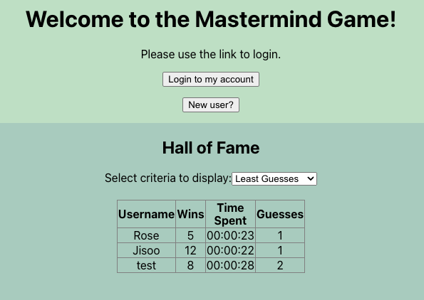
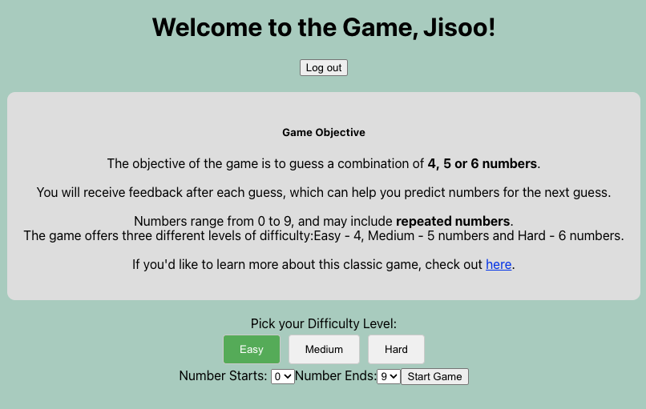
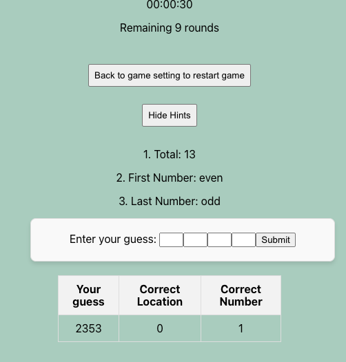

# Mastermind Game 2.0

## Overview
MindGame 2.0 is a number guessing game where players must guess a sequence of random numbers within 10 attempts. The game generates a sequence of random numbers, which can repeat, and challenges the player to guess the correct numbers and their positions.

- The game generates 4/5/6 random numbers between 0 and 9 based on user's selection.
- The user has 10 attempts to guess the sequence.
- The numbers may repeat in the sequence.
- Feedback is provided after each guess to indicate correctness.
- The game ends if the user guesses the sequence or exhausts all attempts.

---
### Code Structure
I built this game as a Full-Stack Web Application utilizing the Model-View-Controller architecture.
The following sections describe the main directories and their responsibilities.

## mindgame-frontend

Contains files related to the frontend of the web application.

- **Views**: The `src` folder contains React components and `App.css` for styling. These are bundled using Webpack and transpiled with Babel to ensure compatibility across various browsers before being served to the client.
- **Main Features**:
  - React-based components for dynamic rendering.
  - Communication with the backend via RESTful APIs.
  - State management to ensure responsiveness during gameplay.

## mindgame-server

Contains files related to the backend of the web application.

### **Controllers**
- `app.py`: The main Flask application that handles routing and processes requests.
  - Functions in this file call **models** to interact with the database and transform data before sending a response to the client.

### **Database**
- `database.py`: Handles the connection to the **PostgreSQL** database using `psycopg2`.

### **Models**
- `scripts/init_db.sql`SQL tables for the database

---
## Technologies Used
<ul>
<li>Python</li>
<li>JavaScript</li>
<li>React</li>
<li>Flask</li>
<li>Psycopg2</li>
<li>Flask-Login</li>
<li>RESTful Services</li>
<li>JSON</li>
</ul>

## Endpoints:
<table>
<thead>
<tr>
<th align="center">HTTP Verb</th>
<th align="left">URI</th>
<th align="left">Functionality</th>
</tr>
</thead>
<tbody>
<tr>
<td align="center">POST</td>
<td align="left">/register</td>
<td align="left">Create a new user instance in the `users` table in the database.</td>
</tr>
<tr>
<td align="center">POST</td>
<td align="left">/login</td>
<td align="left">Validate the user's credentials and log them in if valid.</td>
</tr>
<tr>
<td align="center">POST</td>
<td align="left">/new_game</td>
<td align="left">Create a new game instance in the `Game` table and return a game ID and secret code.</td>
</tr>
<tr>
<td align="center">GET</td>
<td align="left">/halloffame</td>
<td align="left">Retrieve the top 3 users based on the user's selected criteria (e.g., wins, time, guesses).</td>
</tr>
<tr>
<td align="center">POST</td>
<td align="left">/game/&lt;int:game_id&gt;/guesses</td>
<td align="left">Record the user's guess and save it to the `GameGuesses` table.</td>
</tr>
<tr>
<td align="center">GET</td>
<td align="left">/game/&lt;int:game_id&gt;/guesses</td>
<td align="left">Retrieve all guesses for a specific game ID.</td>
</tr>
<tr>
<td align="center">POST</td>
<td align="left">/game/&lt;int:game_id&gt;/win</td>
<td align="left">Record the game as won for the current user.</td>
</tr>
<tr>
<td align="center">POST</td>
<td align="left">/game/&lt;int:game_id&gt;/lose</td>
<td align="left">Record the game as lost for the current user.</td>
</tr>
<tr>
<td align="center">POST</td>
<td align="left">/logout</td>
<td align="left">Log out the current user and clear the session.</td>
</tr>
</tbody>
</table>
---

### Extensions
- Users can customize the number of random numbers to guess: **4, 5, or 6**.
- Flexible range for generated random numbers: **from 0 to 9**.
- A timer is available for each game.
- **Hints** can be displayed during gameplay.
- Supports **multi-player functionality**, allowing users to:
  - Log in with individual accounts.
  - Play their own games.
  - Track progress and feedback.
- User history tracking, including:
  - **Least time spent** 
  - **Most wins** 
  - **Fewest guesses** 

## Sample Play
Example:  

---

